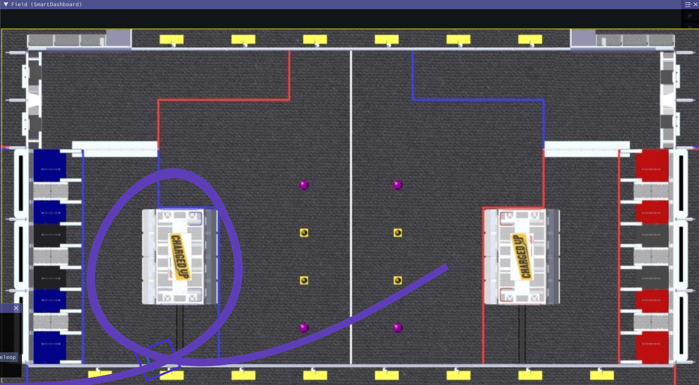
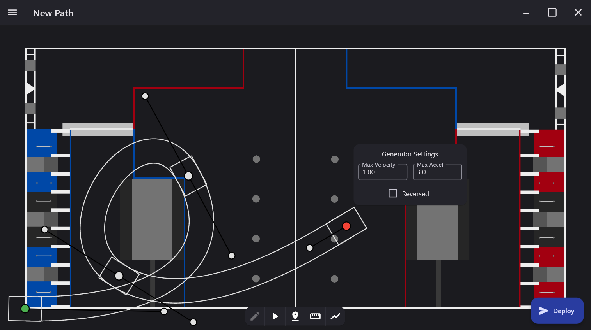

# RamseteExample

A working example of Ramsete simulation using WPILib's simulator.

Uses CTRE SimCollections and WPILib DifferentialDriveSim to simulate drivetrain.

Based off of WPILib Trajectory Tutorial:

https://docs.wpilib.org/en/stable/docs/software/pathplanning/trajectory-tutorial/index.html

Video of me explaining the code + demo:

https://www.youtube.com/watch?v=bnqnbWPdMrQ

Example of Field in action:

This project uses PathPlanner as well:

